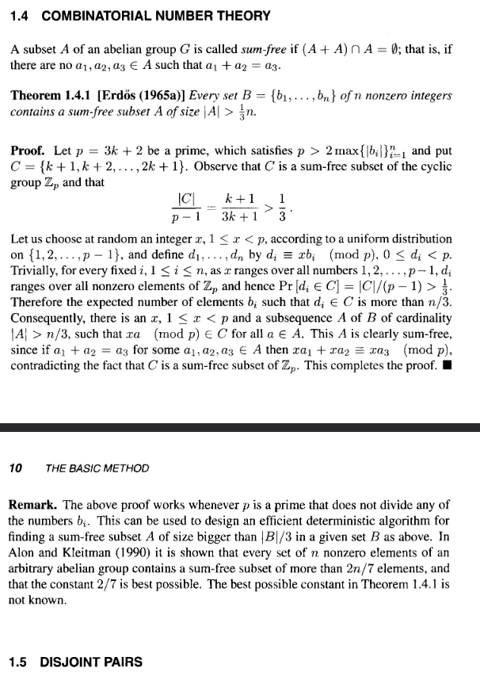

# Sum Free Subsets - The Erdős Way

For subsets $A, B$ of an abelian group $G$, define the *sumset* by 

$$
A + B := \{a + b \, : \, a \in A, \, b \in B\}
$$

Call a subset $A$ of an abelian group $G$ *sum-free* if 

$$
(A + A) \cap A = \emptyset
$$

Namely, if for all $a_1, a_2 \in A$ we have $a_1 + a_2 \not\in A$. 

Questions concerning the size of $|A + B|$ form the basis of much of the field of additive combinatorics. Today we'll concern ourselves with a classical question of Erdős: If $B$ is a finite subset of the nonzero integers $\mathbb{Z} \setminus \{0\}$, what is the largest sum-free subset $A \subseteq B$? 

Erdős provides a marvellous proof&mdash;consisting of around 4 lines&mdash;that, for any choice of $B$, we can take sum-free $A \subseteq B$ with 

$$
|A| > \frac{|B|}{3}
$$

His swift proof can appear esoteric upon first reading. The goal of this exposition is to motivate how Erdős may have came to find this proof, or at least in the worst case explore the general strategy he used in abstract.

For a formal reference, see e.g. CH1 of Alon & Spencer's "The Probabilistic Method". In all editions I've encountered it occupies own short subsection aptly named "combinatorial number theory". 

As an aside, this book is a must-read for anyone looking to find, in the words of Erdős, "book proofs" in combinatorics. Personally, I am yet to find another book so densely populated with beautiful ideas. 

## Sum Free Subsets of $[n]$ 

Let us begin with a simple case to build some intuition. We'll start by taking $B = [n] := \{1, 2, \dots, n\}$. It turns out finding the largest sum-free subset of $B$ isn't too hard in this case&mdash;we can even state it explicitly! This would probably make for a good olympiad training problem, as the only tool we need is the ubiquitous pigeonhole principle (A.K.A Dirichlet's box principle). It is recommended that the reader first encountering sum-free subsets try this themselves first in order to build some intuition. 

As we know $B$ explicitly, it is logical to try and state some large sum-free subsets of $B$. There are two tricks one can try: parity and size. For the former trick, we simply note that the sum of two odd numbers is even, so that 

$$
\{1, 3, \dots\} \cap [n]
$$

is a sum-free subset of $[n]$. Working parity-cases of $n$, we count 

$$
|\{1, 3, \dots\} \cap [n]| = \left\lfloor \frac{n+1}{2} \right\rfloor
$$

For the latter trick, we note that summing two integers in second half of $[n]$ gives an integer greater than $n$, so that the set

$$
\left\{\left\lceil \frac{n+1}{2} \right\rceil, \left\lceil \frac{n+1}{2} \right\rceil + 1, \dots, n\right\} \subset [n]
$$

is sum-free. We then count 

$$
\left|\left\{\left\lceil \frac{n+1}{2} \right\rceil, \left\lceil \frac{n+1}{2} \right\rceil + 1, \dots, n\right\}\right| \geq n - \left\lceil \frac{n+1}{2} \right\rceil + 1 = \left\lfloor \frac{n+1}{2} \right\rfloor 
$$

Both tricks lead to us deducing that the largest sum-free subset of $[n]$ is of size at least $\left\lfloor \frac{n+1}{2} \right\rfloor$. With the pigeonhole principle, we can establish equality. 

**Proposition 1:** For $n \in \mathbb{N}$ the size of the largest sum-free subset $A \subset [n]$ is exactly $\left\lfloor \frac{n+1}{2} \right\rfloor$.

**Proof:** We can establish that the size of the largest sum-free subset $A \subset [n]$ is of size at-least $\left\lfloor \frac{n+1}{2} \right\rfloor$ by letting $A$ be the positive odd-integers less than or equal to $n$. As for the converse, suppose that $A = \{a_1, \dots, a_m\}$ is a sum-free subset of $[n]$. WLOG impose the ordering $a_1 < \dots < a_m$. We must have $a_m - a_i \not\in A$ and $a_m - a_i \leq n$ for each $1 \leq i \leq m-1$, so that 

$$
A^\prime = A \cup \{a_m - a_1, \dots, a_m - a_{m-1}\} \subseteq [n]
$$ 

is a subset of $[n]$ of size $2m - 1$. Hence, $2m - 1 \leq n$ which implies $m \leq \left\lfloor \frac{n+1}{2} \right\rfloor$. This completes the proof. $\quad \square$ 

Note that, in solving this problem, we relied on the structure of $[n]$. This won't be a possible avenue of attack for the problem of finding sum-free subsets of finite $B \subset \mathbb{Z} \setminus \{0\}$. What we'll need to do is decouple ourselves somehow from the structure of $B$. We will get to this shortly. First, let us take a look at sum-free sets in the group of units of the cyclic group $\mathbb{Z} / p \mathbb{Z}$ for prime $p$.

## Sum-Free Sets In $\mathbb{Z}/p\mathbb{Z}$

The study of sumsets does not begin with Erdős. It in fact dates all the way back to Cauchy. Around 30 years before Erdős' proof Davenport was able to prove the following theorem, usually called the Cauchy-Davenport theorem. 

**Theorem 1:** (Cauchy-Davenport) Let $p \in \mathbb{N}$ be prime and $A, B \subseteq \mathbb{Z} / p \mathbb{Z}$. Then 

$$
|A + B| \geq \min(|A| + |B| - 1, p)
$$

There are a bunch of ways of proving this, my personal favourite being with the [*combinatorial nullstellensatz*](https://www.math.tau.ac.il/~nogaa/PDFS/null2.pdf). Davenport originally proved this result with induction on $|A| + |B|$. We elect to omit the proof of this theorem to keep the exposition concise. 

It is safe to assume Erdős was aware of this result, and hence it is likely he proved the following corollary: 

**Corollary 1:** If $p$ is an odd prime and $A \subseteq \mathbb{Z}/p\mathbb{Z}$ is sum-free then 

$$
|A| \leq \left\lfloor \frac{p+1}{3}\right\rfloor
$$

**Proof:** Let $A$ be a sum-free subset of $\mathbb{Z}/p\mathbb{Z}$ so that $A \cap (A + A) = \emptyset$. As this intersection is empty, the inclusion-exclusion principle gives 

$$
|A| + |A + A| = |A \cup (A + A)| \leq p 
$$

with the latter inequality following from the containments $A, A+A \subseteq \mathbb{Z}/p\mathbb{Z}$. Applying theorem 1, we deduce 

$$
|A| \leq p - \min(2|A| - 1, p)
$$

We know that minimum is equal to $p$ if and only if $|A + A| = p$, but note this contradicts the sum-free property as we have the containment $A + A = \mathbb{Z}/p\mathbb{Z} \supseteq A$. Thus, 

$$
|A| \leq p - 2|A| + 1 \Longrightarrow |A| \leq \left\lfloor \frac{p+1}{3}\right\rfloor
$$

This completes the proof. $\quad \square$ 

Can we exhibit a sum-free subset $A$ in $\mathbb{Z}/p\mathbb{Z}$ of size $\left\lfloor \frac{p+1}{3}\right\rfloor$? Recall in the prior section that it sufficed to take the second half of $[n]$ to exhibit a maximal sum-free subset. This same idea won't exactly work&mdash;addition in $\mathbb{Z}/p\mathbb{Z}$ "wraps around"&mdash;but with a small modification it can be made to work. We'll still consider a set of consecutive integers, but this time we need ones that wont "wrap around". 

After a quick head scratch, we should come to realise that taking the middle third does what we need it to. To write this explicitly, it is useful to perform integer division by $3$ on $p$. To that end, let $p = 3m + r$ with $r \in \{1, 2\}$. We exclude the case $r=0$ as it is trivial. If $r = 1$ we can take the middle third set to be 

$$
A = \{m+1, m+2, \ldots, 2m\} \subset \mathbb{Z}/p\mathbb{Z}
$$

We count $|A| = m = \left\lfloor \frac{p+1}{3}\right \rfloor$ so by corollary 1 this is maximal. Finally, for $r=2$, we can take the middle third set to be 

$$
A = \{m+1, m+2, \dots, 2m+1\} \subset \mathbb{Z}/p\mathbb{Z}
$$

We count $|A| = m+1 = \left\lfloor \frac{p+1}{3}\right \rfloor$ so by corollay 1 this is maximal. 

It is worth noting that in the case $p \equiv 2 \pmod{3}$ we have a higher density maximal sum-free subset, as 

$$
\frac{m+1}{3m+2} > \frac{m}{3m+1}
$$

for each $m \geq 0$ 

## Sum-Free Sets In Finite $B \subset \mathbb{Z} \setminus \{0\}$ 

Let $B \subset \mathbb{Z} \setminus \{0\}$ be a finite set. Since we've solved the problem of finding maximal sum-free subsets in $\mathbb{Z}/p\mathbb{Z}$ for primes $p$, it is logical to try and apply this to our general problem of finding maximal sum-free subsets of $B$. There's an easy way to relate the two: simply take $p$ to be a prime large enough to embed $B$ in $\mathbb{Z}/p\mathbb{Z}$. It suffices to take $p > 2\max_{b \in B} |b|$. Notice that for this choice of $p$ we have $p \nmid b$ for each $b \in B$, so that we have an embedding of $B$ into the group of units $(\mathbb{Z}/p\mathbb{Z})^\star$. 
 
Note this doesn't immediately simplify things. We still need to know the structure of $B$ to find a large sum-free subset. However, since we've embedded $B$ into the finite multiplicative group $(\mathbb{Z}/p\mathbb{Z})^\star$, we at least have group structure to work with. [It is often instructive](https://gowers.wordpress.com/2011/11/25/group-actions-iii-whats-the-point-of-them/) in group theory to look at group actions on sets. Our sets of interest are subsets of $B$ (embedded in $(\mathbb{Z}/p\mathbb{Z})^\star$), and the obvious action on these subsets is (left) multiplication, given by

$$
(\mathbb{Z}/p\mathbb{Z})^\star \times C \to(\mathbb{Z}/p\mathbb{Z})^\star, \, (x, c) \mapsto xc
$$ 

The problem with this action is it is still local; it depends on the structure of our subsets $C$, which in turn will depend on the structure of $B \supseteq C$. We can amend this by considering the induced action 

$$
(\mathbb{Z}/p\mathbb{Z})^\star \times \mathcal{P}((\mathbb{Z}/p\mathbb{Z})^\star) \to \mathcal{P}((\mathbb{Z}/p\mathbb{Z})^\star) , \; (x, C) \mapsto xC
$$

where $xC := \{xc : c \in C\}$ and $\mathbb{P}((\mathbb{Z}/p\mathbb{Z})^\star) := \{C : C \subseteq (\mathbb{Z}/p\mathbb{Z})^\star\}$ is the usual [power set](https://en.wikipedia.org/wiki/Power_set). Note that, for each $x \in (\mathbb{Z}/p\mathbb{Z})^\star$ we have $C \subseteq (\mathbb{Z}/p\mathbb{Z})^\star$ sum-free in $\mathbb{Z}/p\mathbb{Z}$ if and only if $xC$ sum-free in $\mathbb{Z}/p\mathbb{Z}$. Hence, it is equivalent to look at the translates $xC$ of a set $C$. 

Let's investigate this idea more abstractly. First, we'll recall some basic definitions from group theory. Let $G$ be a finite group, $X$ a set, and $\alpha: G \times X \to X$ a group action. We define the *induced action on subsets of $X$* by 

$$
\alpha_\text{ind}: G \times \mathcal{P}(X) \to \mathcal{P}(X), \, (g, C) \mapsto \{\alpha(g, c) : c \in C\}
$$

We will call the acted upon set $\alpha(g, C)$ a *translate* of $C$. We define the *orbit* of $x \in X$ under the action $\alpha$ by 

$$
\text{Orb}_\alpha(x) := \{\alpha(g, x) : g \in G\} 
$$

and the *stabiliser subgroup* of $x$ under $\alpha$ by 

$$
\text{Stab}_\alpha(x) := \{g \in G : \alpha(g, x) = x\}
$$

Note it is trivial to see that $\text{Stab}_\alpha(x) \leq G$ is indeed a subgroup. There is a well known theorem connecting orbits and stabilisers, aptly called the *orbit stabiliser theorem*. 

**Theorem 2:** (orbit-stabiliser) In the previously outlined setting

$$
|\text{Orb}_\alpha(x)| \cdot |\text{Stab}_\alpha(x)| = |G|
$$

for all $x \in X$.

**Proof:** [Well known](https://gowers.wordpress.com/2011/11/09/group-actions-ii-the-orbit-stabilizer-theorem/). $\quad \square$

It will be useful to know, for each $x \in X$, in how many of our translates contain $x$. Looking globally over $X$ at these translation counts will tell us about the distribution of elements of $X$ over translates in $G$. It turns out with the orbit stabiliser theorem it isn't too hard to count the occurences of $x \in X$ over our translates $\alpha(g, C), g \in G$. 

**Lemma: 1** (covering formula) In the previously outlined setting, we have for each $x \in X$ 

$$
|\{g \in G : x \in \alpha_{\text{ind}}(g, C)\}| = |C \cap \text{Orb}_\alpha(x)| \cdot |\text{Stab}_\alpha(x)|
$$

**Proof:** Note that, for each $y \in X$, we have 

$$
\alpha(g, \alpha(g^{-1}, y)) = \alpha(gg^{-1}, y) = \alpha(1, y) = y
$$

Hence, 

$$
\{g \in G : x \in \alpha_{\text{ind}}(g, C)\} = \{g \in G : \alpha(g^{-1}, x) \in C\}
$$

As $g$ varies over $G$, it is clear $\alpha(g^{-1}, x)$ ranges over $\text{Orb}_\alpha(x)$. 

**Claim:** For each $y \in \text{Orb}_\alpha(x)$ there are exactly $|\text{Stab}_\alpha(x)|$ solutions $g \in G$ to $g^{-1}x = y$. 

**Proof of claim:** As $y \in \text{Orb}_\alpha(x)$ there is at least one solution, $g_0$. This has 

$$g \cdot y = x = g_0 \cdot y \Longleftrightarrow g_0^{-1}g \cdot y = y \Longleftrightarrow g_0^{-1}g \in \text{Stab}(y)$$

and hence, the solutions are exactly the coset $g_0 \cdot \text{Stab}_\alpha(y)$. By the orbit stabiliser theorem, any two points in same orbit have equally sized stabilisers. Hence, as $y \in \text{Orb}_\alpha(x)$ we have 

$$
|g_0 \cdot \text{Stab}_\alpha(y)| = |g_0 \cdot \text{Stab}_\alpha(x)| = |\text{Stab}_\alpha(x)|
$$

This establishes the claim. $\quad \square$ 

Hence, following up with our claim, we deduce that 

$$
|\{g \in G : \alpha(g^{-1}, x) \in C\}| = |\text{Orb}_\alpha(x) \cap C| \cdot |\text{Stab}(x)| 
$$

This completes the proof. $\quad \square$

Everyone's favourite distribution is the uniform distribution. By the covering lemma, our translates uniformly distribute the elements of $X$ if and only if $\forall x \in X$ we have 

$$
\text{Stab}_\alpha(x) = \{1\} \quad \text{and} \quad \text{Orb}_\alpha(x) = X
$$

Actions obeying the former property are called *free* and actions are obeying the latter property are called *transitive*. Using this terminology, we can make the following concise deduction from the covering lemma: 

> occurences of $x \in X$ are uniformly distributed across translates $\alpha_{\text{ind}}(g, C), \, g \in G$ if and only if the action $\alpha$ is free and transitive. 

Let us return to our action multiplication action 

$$
(\mathbb{Z}/p\mathbb{Z})^\star \times C \to(\mathbb{Z}/p\mathbb{Z})^\star, \, (x, c) \mapsto xc
$$ 

with induced action

$$
(\mathbb{Z}/p\mathbb{Z})^\star \times \mathcal{P}((\mathbb{Z}/p\mathbb{Z})^\star) \to \mathcal{P}((\mathbb{Z}/p\mathbb{Z})^\star) , \; (x, C) \mapsto xC
$$

It is easy to see that this is a free, transitive action: this motivates the following tactic for exhibiting the existence large-sum-free subsets:

> Let $C$ be the maximal sum-free subset of $(\mathbb{Z}/p\mathbb{Z})^\star$ and consider the intersections $xC \cap B$ over $x \in (\mathbb{Z}/p\mathbb{Z})^\star$. 

Any such intersection will be a sum-free subset of $B$ in $\mathbb{Z}/p\mathbb{Z}$ and hence in $\mathbb{Z} \setminus \{0\}$. Hence, if we exhibit the existence of a large one, we win. 

To that end, using the fact that the elements of $(\mathbb{Z}/p\mathbb{Z})^\star$ are uniformly distributed over the translates $xC, x \in (\mathbb{Z}/p\mathbb{Z})^\star$, we see that 

$$
\mathbb{E}_{x \sim \text{unif}((\mathbb{Z}/p\mathbb{Z})^\star)}[|xC \cap B|] = \frac{|C| \cdot |B|}{|(\mathbb{Z}/p\mathbb{Z})^\star|}
$$

for any subset $C \subseteq (\mathbb{Z}/p\mathbb{Z})^\star$. It is clear we win by making $C$ as large as possible, which we did with the middle-third construction last section. This choice of $C$ has $|C| = \left\lfloor \frac{p+1}{3}\right \rfloor$ so that 

$$
\mathbb{E}_{x \sim \text{unif}((\mathbb{Z}/p\mathbb{Z})^\star)}[|xC \cap B|] = \frac{\left\lfloor (p+1)/3\right \rfloor}{p-1} \cdot |B| 
$$

Via Dirichlet's theorem, take $p = 3m + 2$ and deduce 

$$
\mathbb{E}_{x \sim \text{unif}((\mathbb{Z}/p\mathbb{Z})^\star)}[|xC \cap B|] > \frac{|B|}{3}
$$

Thus, there must exist some $x$ such that $A = xC \cap B$ is a sum-free subset of $B$ with $|A| > |B|/3$, establishing the result of Erdős. Note this expected value -> existence trick is usually called the *first moment method* by probabilistic combinatorialists, though it's really just the pigeonhole principle in disguise. 

## Concluding Remarks 

Our abstractions give the following general approach to solving combinatorial problems of the form 

> Let $X$ be a finite set. Find a large subset $Y \subseteq X$ with property $\mathcal{P}$.

where $\mathcal{P}$ is a monotone (downward closed) property. 

**Step 1:** (embed into a finite group)
Find an embedding $\iota: X \hookrightarrow G$ where:
- $G$ is a finite group
- The property $\mathcal{P}$ can be "seen" in $G$.

**Step 2:** (find a $\mathcal{P}$-preserving action)
Identify a group action $\alpha: G \times G \to G$ with:
$$
Y \text{ has property } \mathcal{P} \implies gY \text{ has property } \mathcal{P} \quad \forall g \in G
$$
for subsets $Y \subseteq X$ embedded into $G$. Ideally this action will be transitive

**Step 3:** (construct template)
Find a subset $Z \subseteq G$ satisfying:
1. $Z$ has property $\mathcal{P}$
2. $|Z|/|G| = \alpha$ is as large as possible

Ideally, the action on $Z$'s orbit will be free.

**Step 4:** (compute translate distribution)
The covering formula (Lemma 1) gives, for each $x \in X$:
$$|\{g \in G : x \in gZ\}| = |Z \cap \text{Orb}(x)| \cdot |\text{Stab}(x)|$$
Compute this for each $x \in X$

**Step 5:** (compute expected intersection with $X$)
Let $X^\prime= \iota(X) \subseteq G$. By summing the covering formula over $X^\prime$:
$$
\sum_{g \in G} |gZ \cap X^\prime| = \sum_{x \in X^\prime} |Z \cap \text{Orb}(x)| \cdot |\text{Stab}(x)|$$
Compute this sum via step 4 and deduce the value of 
$$
\mathbb{E}_{g \sim \text{Unif}(G)}[|gZ \cap X^\prime|] =: \alpha
$$

Thus, exhibit the existence of a subset $Y \subseteq X$ with property $\mathcal{P}$ of size $\alpha$.

Note that, being probabilistic combinatorialists, we need not use the first moment method in step 5. Given we know the translate distribution (or at least hopefully some things about it), we can apply any number of probabilistic tricks (e.g. Chebyshev's inequality, MGFs, entropy, LLL) to deduce existence. We could even randomly sample our target $Z$. This process begs adaption. 

I imagine it is this line of reasoning that Erdős would've used to construct his proof. He would've known the solution in $(\mathbb{Z}/p\mathbb{Z})^\star$ and the orbit stabiliser theorem with probability $1 - \epsilon$, and at this point he'd already brought the first moment method to light. Given all this, the proof is simple: though being the first connecting the dots is what made him such a brilliant combinatorialist. 

I tried to motivate how these dots were connected as best as I could, but I am no Erdős. Eitherway, this exposition should shed some light on the proof and how these ideas can be taken into new problems. I'll conclude with the snippet of Alon & Spencer's book where I first encountered this proof, and why I felt this exposition was warranted. 

I probably have spent over 2 days postulating as to what the diety visiting Erdős must have told him for him to arrive at this proof. Hence, this exposition.